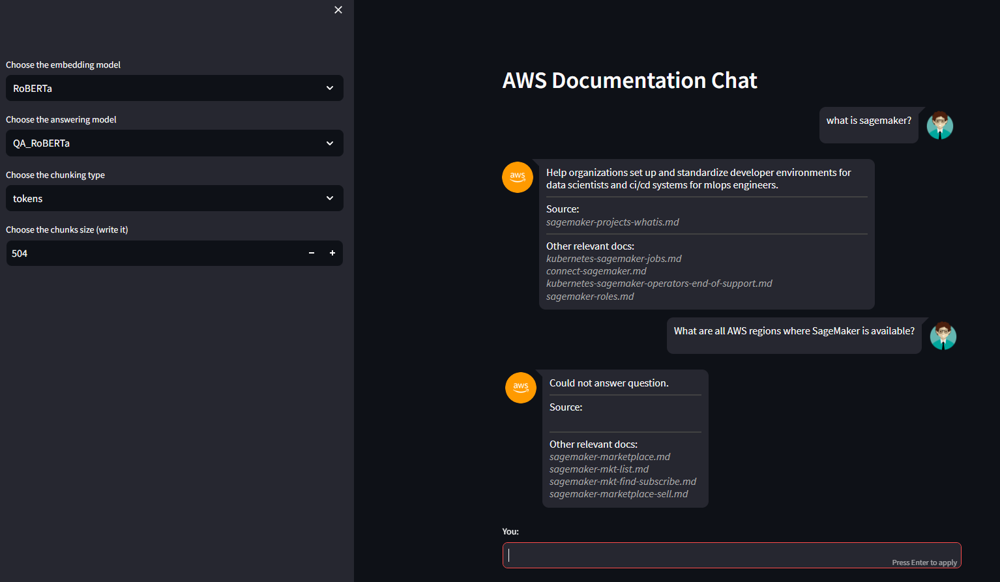
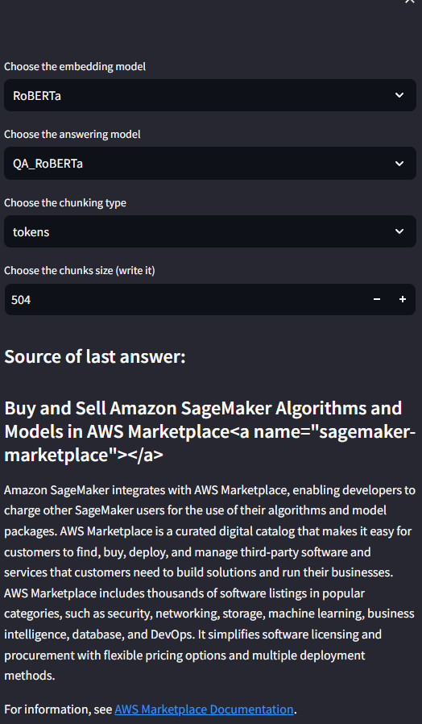

# AWS Documentation Chat

This is the demo solution for the ML Engineer interview task. 

An easier way to navigate the company documentation is implemented through a QA chat bot.
The bot answers questions and provides the source for the answer, as well as other relevant documentation files that may be of use.

### Running the application

You have an option to run the application yourselves, by building the docker image for which the Dockerfile is provided.

The following commands should be ran, assuming you have docker configured on your machine:

```azure
docker build -t doc_chat .
docker run -p 8501:8501 doc_chat
```

Then open your browser on http://localhost:8501/?name=main to see the frontend.

### Application snippets

On the picture below you can see a snippet of some of the answers and sources provided.
Also, while in development the team would be able to select the models and chunking parameters.



On the picture below you can see a snippet of the sidebar on which the source document of the last answer is provided,
if the system is able to answer the question. 


